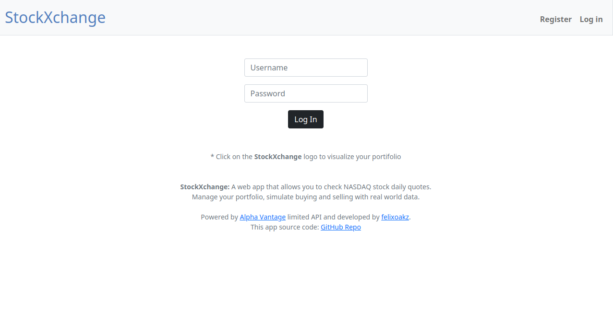
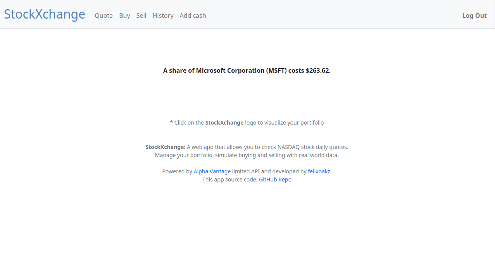
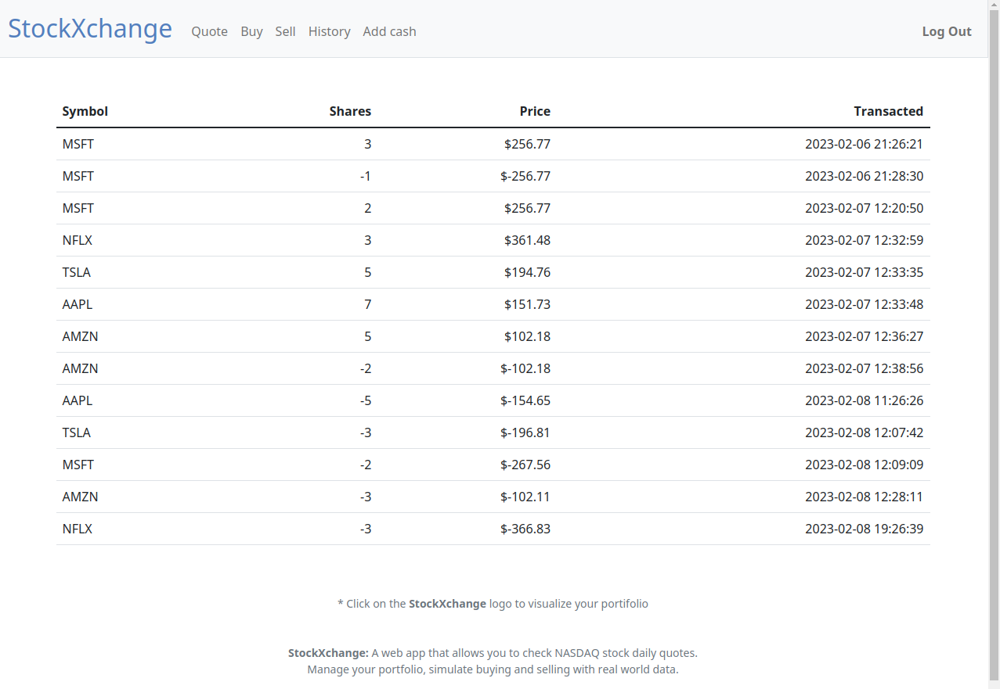
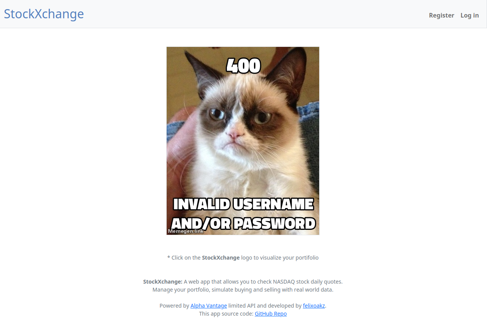

# *StockXchange*
- *A web app for managing stock portfolios with real world data.*

## Live Demo
Check out the live demo at [stockXchange.onrender.com](https://stockxchange.onrender.com/)

Note: Please keep in mind that this is a demo version, so the server might be slow sometimes and the API used is limited. Both are free, so no complaints here!
 

## Features

With StockXchange, you can manage portfolios of stocks and check their actual prices and portfolio values in real-time with real world data. This app is fully mobile compatible, allowing you to access your portfolios on the go. You can also "buy" and "sell" stocks by querying an API for their prices and keep track of your portfolio and transaction history.

## Technical Details

This app was built with Flask and encapsulated by Gunicorn for hosting on Render 24/7. It builds from my GitHub repo and any editing I make locally and push via Git CLI, it automatically updates the remote server and creates a new build. The client-side uses Jinja templating engine, vanilla HTML, Bootstrap, and just a tiny bit of CSS for simplicity.

Your password is hashed with Wekzeug security before being written to the database. The session is configured to use the file system instead of signed cookies. The API is included in the .gitignore file but accessed on the server via an environment variable.

The AlphaVantage API was used, which serves the purpose of the demo, but sometimes exceeds the API limit and impact app functionality. The API calls a local CSV file with a list of symbols and names to add the company names, as the API doesn't provide this information in the JSON. The database is volatile on the server and it can have some impact of the functionality and validations on the live site. 

## Idea

The idea for this app started as a Harvard CS50 course project using a stock data API and a database to write and store information. The biggest challenge was adapting the app for hosting, which involved creating a new database function as well as finding a free API to fetch the desired data.

## Lessons learned

As this was my first full-fledged web app, it taught me a lot, from learning various tools to debugging when the API returned None instead of results. In the future, I would like to improve this app by using more functions or even Django for abstracting some things like the login and session functions. I would also try to get better data from stocks using a better API or web scraping. Implement some JavaScript and AJAX on the front-end to display stock prices and symbols as the user types. I think it would be cool to gamify the app with a leaderboard and a payment api charging a small fee for the "adding cash" function.

## Screenshots:

